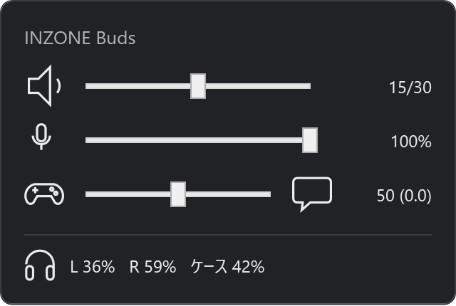

# OpenInzone

English · [日本語](README.ja.md)

An open, unofficial reimplementation of INZONE Hub's device control: a tray application and a
command line tool for Windows.

> **Not affiliated with Sony.** OpenInzone is an independent project. It is not affiliated with,
> authorised, sponsored or endorsed by Sony Group Corporation or any of its affiliates. "Sony",
> "INZONE" and "INZONE Hub" are trademarks of Sony Group Corporation or its affiliates, used here
> only to identify the hardware and the vendor application this project interoperates with.

Control a Sony INZONE headset from the notification area, a physical key, or the command line,
without INZONE Hub.

INZONE Hub can adjust the headphone volume and the game/chat balance, but only through its own
window. This talks to the dongle directly over the same HID channel, so the same settings can be
reached from a panel in the notification area, bound to a key, scripted, or read from a status
bar.

There are two programs, and one download carries both:

| | |
|---|---|
| `inzonetray.exe` | the tray application — an icon in the notification area, a panel and global hotkeys. **This is the one most people want.** |
| `inzone.exe` | the command line tool — the same settings from a terminal, with JSON for scripting |

One left click on the tray icon opens this:



Built and verified against **INZONE Buds** (`VID_054C` / `PID_0EC2`). The protocol is shared
across the INZONE range, so other models are likely to work, but only INZONE Buds has been tested.

## Contents

- [What it can do](#what-it-can-do)
- [Requirements](#requirements)
- [Install](#install)
- [Using the tray](#using-the-tray)
- [Hotkeys and settings](#hotkeys-and-settings)
- [Troubleshooting](#troubleshooting)
- [Command line](#command-line)
- [Scripting](#scripting)
- [Developer guide](#developer-guide)
- [Related projects](#related-projects)
- [License](#license)
- [Trademarks and scope](#trademarks-and-scope)

## What it can do

- Game/chat balance, 0–100
- Headphone volume, 0–30, and mute
- Microphone mute and level
- Battery for both earbuds and the case
- Watch for changes made elsewhere, including from the earbuds themselves

## Requirements

- Windows 10 1809 or later, x64
- The INZONE USB dongle, plugged in, with the earbuds out of the case and connected

Nothing else needs installing. The download is self-contained, so there is no .NET runtime to set
up first.

Windows only. On Linux, [zoneout](https://github.com/marcinjakubowski/zoneout) covers the same
device and more of it — see [Related projects](#related-projects).

INZONE Hub does not need to be closed. The control interface is opened with sharing enabled, so
both can be connected at once — handy while trying this out, since you can watch INZONE Hub's own
sliders move.

## Install

No terminal, and no administrator rights. Download one file, run it, and the icon is in the
notification area.

### 1. Download the installer

Open the [latest release](https://github.com/penguinwokrs/openinzone/releases/latest), scroll down
to **Assets**, and click **`OpenInzone-<version>-setup.exe`** — with the current release that file
is `OpenInzone-0.1.0-setup.exe`. It lands in your Downloads folder like any other download.

The other file there, `OpenInzone-<version>-win-x64.zip`, is the same two programs without an
installer. It needs a terminal, so it is covered under [Command line](#command-line).

### 2. Run it, and get past the warning

Double-click the file you downloaded. Windows will stop you with a blue window saying
**"Windows protected your PC"**.

That is SmartScreen. It appears because this build is not code-signed — signing certificates cost
money, and this is a free project — not because anything is wrong with the file. Click
**More info**, and then the **Run anyway** button that appears underneath.

The installer opens with a language prompt; the wizard itself is available in English, though the
two optional checkboxes on the next page and the tray application's own menus are in Japanese.

### 3. Take the defaults

It installs for you rather than for the whole machine, so it never asks for administrator rights,
and it puts the programs in `%LOCALAPPDATA%\Programs\OpenInzone` with a Start menu entry.

Two checkboxes are worth knowing about:

| Checkbox | |
|---|---|
| Windows の起動時に常駐する (run at startup) | ticked — the tray comes up with Windows |
| デスクトップにショートカットを作成する (desktop shortcut) | not ticked |

The last page offers to start OpenInzone straight away. Leave that ticked and click **Finish**.

### 4. That is it

A headphone icon appears in the notification area, at the right-hand end of the taskbar. Windows
often hides new icons behind the **^** arrow there: click the arrow, and drag the icon out onto the
taskbar to keep it in sight.

Left click it. If the panel shows your model name and some numbers, everything works — see
[Using the tray](#using-the-tray). If it says 未接続 (not connected), check the dongle is plugged
in and the earbuds are out of the case, then see [Troubleshooting](#troubleshooting).

To remove it later: **Settings → Apps → Installed apps → OpenInzone → Uninstall**. That leaves
`%APPDATA%\openinzone` alone, so the keys you chose survive a reinstall.

### Installing with winget

```
winget install penguinwokrs.OpenInzone
```

> **Not yet available.** OpenInzone has not been submitted to the public winget repository, so
> this command will fail until that happens. Use the installer above until then.

For the maintainer: each release attaches three winget manifest files
(`penguinwokrs.OpenInzone.yaml`, `.installer.yaml` and `.locale.en-US.yaml`) under
**Assets**, generated from the templates in `packaging/winget/` with that release's version,
download URL and SHA-256 already filled in. Submitting a version means either running
`wingetcreate submit` against the downloaded folder, or opening a pull request by hand against
[microsoft/winget-pkgs](https://github.com/microsoft/winget-pkgs) with those three files placed
under `manifests/p/penguinwokrs/OpenInzone/<version>/`. Both routes need a GitHub account with
permission to fork that repository; nothing here automates either one.

## Using the tray

`inzonetray.exe` is the one to start. It puts an icon in the notification area and stays there:
the installer's **run at startup** task brings it up with Windows, and from the zip it is the
executable itself. Only one copy runs — start a second and it exits at once, leaving the first
holding the hotkeys.

**Left click the icon** for a panel at the bottom-right of the monitor the notification area is
on. It carries three sliders and the battery levels — the panel pictured at the top of this
page:

| Slider | What it moves |
|---|---|
| headphone volume | the headset's own volume, 0–30 — not the Windows playback volume |
| microphone level | the Windows capture endpoint for the headset, 0–100 |
| game/chat balance | 0–100, shown on the -5.0 to +5.0 scale INZONE Hub uses |

Clicking the microphone icon toggles the headset's microphone mute, and the icon gets a red slash
while it is muted. The speaker and the game/chat icons are labels rather than buttons; the
headphone mute is on the command line, as `inzone volume mute`.

The microphone is split on purpose: the slider is the Windows endpoint, the mute is the headset's
own flag. That is what INZONE Hub does, because only the mute is on the wire — `docs/PROTOCOL.md`
records why. See [Which volume is which](#which-volume-is-which).

Dragging a slider does not flood the HID channel. Writes are coalesced onto a 100 ms timer, and
the value you release on is always sent.

Below the sliders are the battery levels for both earbuds and the case. The case number is the
same snapshot the command line reports: see [Battery](#battery) for why it can sit still for
hours, and for what charging does not tell you.

The panel closes as soon as it loses focus. **Right click the icon** for a menu with 設定
(settings) and 終了 (exit); hovering over it shows the model, the volume and the battery.

## Hotkeys and settings

The tray holds eight global hotkeys. They work from any application, including from inside a
full-screen game:

| Command | Default |
|---|---|
| 音量を上げる / 下げる (volume up / down) | `Ctrl+Alt+Right` / `Ctrl+Alt+Left` |
| バランスをゲーム寄りに / チャット寄りに (balance towards game / chat) | `Ctrl+Alt+Up` / `Ctrl+Alt+Down` |
| バランスを中央に (balance to the middle) | `Ctrl+Alt+Home` |
| マイクミュート切り替え (toggle microphone mute) | `Ctrl+Alt+Shift+M` |
| マイクレベルを上げる / 下げる (microphone level up / down) | `Ctrl+Alt+PageUp` / `Ctrl+Alt+PageDown` |

**設定** in the right-click menu opens a window listing all eight with the key each one holds.
Select a row and press a combination to assign it; `Esc` clears a row to unassigned. A combination
another application already holds is marked as in use the moment you press it, so you find out
there rather than by pressing it later and getting nothing. 既定に戻す (restore defaults) puts
every row back, and saving re-registers the hotkeys immediately — there is nothing to restart.

Below the table are two checkboxes, the version this copy is, and an update button. Windows の起動
時に常駐する starts the tray with Windows. 起動時に更新を確認する asks GitHub once per login
whether a newer release exists, and says nothing unless there is one; it is off until you tick it.
更新を確認 (check for updates) asks the same question there and then, and reports what it found
rather than only good news — that you are current, that a newer release exists but has no installer
attached, or that GitHub's answer could not be read. When there is one the button becomes 更新,
which downloads that release's installer, checks it against the SHA-256 GitHub publishes alongside
it, and runs it; the tray exits so the installer can replace it, and the installer starts it again.

If a combination cannot be registered when the tray starts, because something else claimed it
first, a balloon names the commands affected. Every other hotkey still works.

Because the tray keeps the device open and caches the current values, a held-down key applies one
write per press instead of a read and a write, so repeats stay responsive.

The assignments live in `%APPDATA%\openinzone\hotkeys.json`, keyed by command id:

```json
{
  "bindings": {
    "volume-up": "Ctrl+Alt+Right",
    "volume-down": "Ctrl+Alt+Left",
    "balance-game": "Ctrl+Alt+Up",
    "balance-chat": "Ctrl+Alt+Down",
    "balance-centre": "Ctrl+Alt+Home",
    "mic-mute": "Ctrl+Alt+Shift+M",
    "mic-up": "Ctrl+Alt+PageUp",
    "mic-down": "Ctrl+Alt+PageDown"
  },
  "autostart": false,
  "checkForUpdatesAtStartup": false
}
```

Hand-editing works as well as capturing. An empty string leaves that command unassigned, and a
**key** is the modifiers `Ctrl`, `Alt`, `Shift`, `Win` plus one key: letters and digits,
`F1`–`F24`, arrows, `Home`, `End`, `PageUp`, `PageDown`, `Insert`, `Delete`, `Space`, `Enter`,
`Tab`, `Escape`, `Backspace`, the numpad operators, and the media keys `VolumeUp`, `VolumeDown`,
`VolumeMute`, `MediaNext`, `MediaPrev`, `MediaStop`, `MediaPlayPause`.

A configuration file left by an earlier version is in a different shape, and is migrated when the
tray reads it, so an upgrade keeps the keys you chose.

Starting with Windows is a `Run` entry under `HKCU`, written either by that checkbox or by the
installer's optional task. Both mean the same thing, so setting it in one place and clearing it in
the other is not a conflict.

## Troubleshooting

**The panel says 未接続, or "No INZONE dongle found."**
The dongle is not plugged in, or it enumerates with a product id this does not know. From a
terminal, `inzone devices` lists what was found:

```console
PS> inzone devices
VID_054C&PID_0EC2 UsagePage=0xFF04 Usage=0x0001 In=64 Out=64 "Hid Interface"
  \\?\hid#vid_054c&pid_0ec2&mi_05&col03#8&29ddaaec&0&0002#{4d1e55b2-f16f-11cf-88cb-001111000030}
```

If that is empty too, check that a device with vendor `054C` and usage page `0xFF04` is present.
Discovery matches on capability rather than a fixed product id, so a different INZONE model should
still be found.

**"The headset did not answer ... within 1500 ms."**
The dongle is there but the earbuds are not reachable — still in the case, out of range, or
powered off. Take them out and try again.

**"Windows protected your PC", or the exe will not start.**
Nothing here is code-signed, so SmartScreen asks about the installer: choose
**More info → Run anyway**. If instead you unpacked the zip, the files still carry their mark of
the web — run `Unblock-File` recursively over wherever you put them, as
[Command line](#command-line) shows.

**`inzone` is not recognised as a command.**
The PATH step was skipped, or the terminal predates it. Open a new terminal, or run the executable
by path: `& "$env:LOCALAPPDATA\Programs\OpenInzone\inzone.exe" status` for the installer,
`& "$env:LOCALAPPDATA\OpenInzone\inzone.exe" status` for a zip unpack.

**A balloon says a hotkey could not be registered.**
Something else registered that combination first; graphics drivers and chat applications are the
usual culprits. Pick another combination in 設定. The remaining hotkeys still work.

**`inzone mic` shows the mute state but no level.**
Windows is not currently exposing a capture endpoint for the headset. The mute flag lives on the
headset and keeps working; the level is a Windows setting and needs that endpoint.

## Command line

`inzone.exe` reaches the same settings without the tray, one at a time — which is where scripting
and status bars start. Everything from here to the end of this section wants a terminal:
right-click the Start button → **Terminal**.

### Getting inzone.exe

If you ran the installer, it is already there, in `%LOCALAPPDATA%\Programs\OpenInzone` beside the
tray. Skip to [Put it on PATH](#put-it-on-path).

If you would rather not run an installer at all, `OpenInzone-<version>-win-x64.zip` on the
[latest release](https://github.com/penguinwokrs/openinzone/releases/latest) carries the same two
programs — `inzone.exe` and `inzonetray.exe`, with `LICENSE` and the .NET runtime they need — and
installs nothing. Unpack it somewhere permanent:

```powershell
$dir = "$env:LOCALAPPDATA\OpenInzone"
$zip = (Get-Item "$env:USERPROFILE\Downloads\OpenInzone-*-win-x64.zip").FullName
Expand-Archive $zip -DestinationPath $dir -Force
Get-ChildItem $dir -Recurse | Unblock-File
```

`Unblock-File` clears the mark Windows puts on anything that came from the internet. Without it
the first run is met with **"Windows protected your PC"**. Neither download is code-signed, so
SmartScreen can appear for the installer as well; choose **More info → Run anyway**.

Unpacking the zip gives you no Start menu entry and no autostart task. The tray's 設定 window has
a checkbox for starting with Windows, which writes the same registry entry the installer would.

### Put it on PATH

So that `inzone` works from any directory, not just the folder it sits in:

```powershell
$dir = "$env:LOCALAPPDATA\Programs\OpenInzone"      # or wherever the zip was unpacked
[Environment]::SetEnvironmentVariable(
    "Path",
    [Environment]::GetEnvironmentVariable("Path", "User") + ";$dir",
    "User")
```

Close the terminal and open a new one for that to take effect.

This step is optional. Skipping it means writing `.\inzone.exe` from inside the folder wherever the
examples below say `inzone`.

### Check the headset is found

With the dongle plugged in and the earbuds out of the case:

```console
PS> inzone status
Device       INZONE Buds
Serial       L 3015430 / R 3015430 / dongle 3015430
Battery      L 97%  R 97%  case 34%
Balance      50 (0.0)
Volume       15/30
Microphone   unmuted, level 100%
Sidetone     0
```

If this prints numbers, everything below will work. If it prints an error instead, see
[Troubleshooting](#troubleshooting).

### Change something

Open INZONE Hub next to the terminal and watch its slider move as you run these.

```console
PS> inzone balance +10
60 (+1.0)

PS> inzone balance +10
70 (+2.0)

PS> inzone balance centre
50 (0.0)
```

The number in brackets is the scale INZONE Hub shows, -5.0 to +5.0.

The headphone volume and the microphone work the same way:

```console
PS> inzone volume 20
20/30

PS> inzone volume -1
19/30

PS> inzone mic toggle
muted
```

### Battery

`inzone battery` shows charge for both earbuds and the case.

The case percentage is not a live reading. The case has no radio of its own, so its level only
reaches the dongle when you put an earbud in — that is the moment it catches up. A case left
charging on its own keeps reporting the same number however long you wait: in one measurement it
sat at 36% for 37 minutes on a charger, then jumped straight to 42% the moment an earbud went in.
Both earbuds in the case means nothing answers at all, and `inzone battery` says so and exits 1.

**Charging is not reported.** The headset sends nothing that distinguishes charging from not
charging, so neither this tool nor INZONE Hub can show it. An earbud that has been in the case
simply comes back with a higher percentage.

### Watch changes as they happen

Leave this running and change the balance from INZONE Hub, or from the earbuds themselves:

```console
PS> inzone watch
Watching INZONE Buds. Press Ctrl+C to stop.
01:20:20  GameChatMixBalance     60 (+1.0)
01:20:21  HeadphoneVolume        16/30
01:20:23  BatteryInfo            L 94%  R 94%  case 34%
01:20:24  MicVolume              muted
```

The headset's replies reach every program that has the interface open, so `watch` also shows
traffic caused by INZONE Hub or by another copy of this tool — not only changes made at the
earbuds. Repeated lines for one change are normal: the headset answers the request and then
announces the new value.

This is what makes a status bar or stream overlay possible: pipe it somewhere and read it.

### Command reference

```
inzone status                 Show everything at once
inzone devices                List the control interfaces found

inzone balance                Show the game/chat balance
inzone balance 70             Set it (0 = all chat, 100 = all game)
inzone balance +10 | -10      Move it by a step
inzone balance centre         Back to the middle

inzone volume                 Show the headphone volume
inzone volume 20              Set it (0-30)
inzone volume +1 | -1         Move it by a step
inzone volume mute | unmute | toggle

inzone mic                    Show the microphone state
inzone mic mute | unmute | toggle
inzone mic 50                 Set the level (0-100)
inzone mic +5 | -5            Move the level by a step

inzone battery                Show charge levels
inzone watch                  Print changes as they happen
inzone watch battery          Print changes to one event only
                              (battery, balance, volume, mic, sidetone)

--json                        Any command, as one JSON object
                              (watch emits one object per line)
--raw                         Add the undecoded bytes to battery output
```

`inzone --help` prints the same list.

### Which volume is which

Worth being precise about, because the names invite the wrong guess:

| Command | What it moves |
|---|---|
| `inzone volume` | the **headset's own** volume, 0–30, the same slider INZONE Hub shows |
| `inzone mic` level | the **Windows capture endpoint** for the headset, 0–100 |
| `inzone mic mute` | the **headset's own** microphone mute |

`inzone volume` does not touch the Windows playback volume, and neither does INZONE Hub. The
microphone is the one setting INZONE Hub splits across both worlds, and this follows it.

## Scripting

`--json` works on every command, not just `battery` — add it and you get one JSON object on
stdout instead of the aligned columns. `watch --json` prints one object per line instead, so each
line is a complete record on its own.

### Examples

```console
$ inzone battery --json
{"left":51,"right":71,"case":34,"detail":{"left_state":"reporting","right_state":"reporting","case_state":"reporting","case_is_snapshot":true}}
```

```console
$ inzone status --json
{"device":"INZONE Buds","serial":{"left":"3015430","right":"3015430","dongle":"3015430"},"battery":{"left":51,"right":71,"case":34,"detail":{…}},"balance":{"value":50,"notch":0},"volume":{"value":15,"max":30,"muted":false},"mic":{"muted":false,"level":100,"level_available":true},"sidetone":{"value":0}}
```

```console
$ inzone watch battery --json
{"time":"05:21:11","event":"battery","left":57,"right":78,"case":34,"detail":{…}}
{"time":"05:23:21","event":"battery","left":56,"right":78,"case":34,"detail":{…}}
```

The vocabulary matches on purpose: `inzone watch battery` and `jq 'select(.event=="battery")'`
pick out the same thing, one server-side and one client-side.

```console
$ inzone watch --json | jq -c 'select(.event=="battery")'
```

### What the battery keys mean

`left`, `right` and `case` are percentages, or `null` when that part is not reporting — an earbud
sitting in the case, or a case level that has never been relayed.

A headset model has no separate right earbud and no case, so on that model those keys are
**absent** from the object rather than `null`. `null` means "this part exists but is not
reporting right now"; a missing key means "this model has no such part".

`detail.case_is_snapshot` is always `true` for earbuds. The case has no radio of its own — an
earbud relays its level when it is docked, so the number is a snapshot from that moment, not a
live reading.

`detail.raw` appears only with `--raw`, and carries the undecoded bytes.

### Exit codes

| Code | Meaning |
|---|---|
| 0 | Success |
| 1 | The device side failed — no dongle, earbuds in the case, no answer |
| 2 | The command itself was wrong — unknown command, unknown watch filter, a value that is not a number |

The split is there for anything polling on a timer: it can tell "I typed this wrong" apart from
"they are charging", and decide whether retrying is worth it.

### Errors are JSON too

In text mode, errors go to stderr, same as always. Under `--json`, everything goes to stdout —
success or failure — so a consumer reading stdout gets exactly one object either way:

```console
$ inzone battery --json          # with both earbuds in the case
{"error":"unreachable","message":"The earbuds did not answer. They are in the case, out of range, or off."}
```

### Watch filters

`inzone watch` takes filter words to print changes to just one thing: `battery`, `balance`,
`volume`, `mic`, `sidetone` — the same words the `event` field carries above.

---

## Developer guide

Everything below is about building OpenInzone from source and working on it. None of it is needed
to use the released build.

### What you need

- .NET 8 SDK
- The dongle and the earbuds, for anything beyond the protocol tests
- Windows to run it; the build itself also works from Linux or WSL

`OpenInzone.Core`, `OpenInzone.Control` and the CLI target `net8.0` and reach Windows only through
P/Invoke and COM. The tray is a WPF application on `net8.0-windows`, and `EnableWindowsTargeting`
lets even that one build off Windows. So the whole solution compiles anywhere the SDK runs; only
the resulting `.exe` is Windows-only.

### Building on Windows

```powershell
winget install Microsoft.DotNet.SDK.8
git clone https://github.com/penguinwokrs/openinzone.git
cd openinzone

dotnet publish src\OpenInzone.Cli  -c Release -r win-x64 --self-contained true -p:PublishSingleFile=true -o publish
dotnet publish src\OpenInzone.Tray -c Release -r win-x64 --self-contained true -o publish\tray
```

That leaves `inzone.exe` in `publish\` and `inzonetray.exe` in `publish\tray\`, needing nothing
installed on the machine that runs them — the same programs the release downloads contain. The
tray publishes as a folder rather than a single file, which is the shape both the installer and
the zip ship. Drop `--self-contained true` for much smaller binaries if the .NET 8 runtime is
already present.

```console
PS> .\publish\inzone.exe status
```

`dotnet run --project src\OpenInzone.Cli -- status` works too, for a quick loop without
publishing.

### Building from WSL

This cross-builds from WSL without anything extra. If the SDK was installed with the
`dotnet-install.sh` script rather than a package manager, put it on the path first:

```sh
export DOTNET_ROOT="$HOME/.dotnet"
export PATH="$HOME/.dotnet:$PATH"
```

```sh
dotnet publish src/OpenInzone.Cli  -c Release -r win-x64 --self-contained true -p:PublishSingleFile=true -o publish
dotnet publish src/OpenInzone.Tray -c Release -r win-x64 --self-contained true -o publish/tray
```

The resulting `.exe` runs straight from the WSL path through the usual interop, so
`./publish/inzone.exe status` works from the repository directory — the dongle is reached through
the Windows side, no USB passthrough involved.

The tray is the exception: WSL is a poor place to exercise it, since global hotkeys are registered
against the Windows session and the panel is a Windows desktop window. It builds and it starts,
but try it from Windows.

`installer/build.sh 0.1.0` builds the installer from here too. It publishes both programs into
`dist/`, then hands them to the Windows-side Inno Setup compiler, which has to be installed on
that side (`winget install --id JRSoftware.InnoSetup`).

That last hand-off is through the `\\wsl.localhost` share, which occasionally gives the compiler
an incomplete view of a directory the Linux side already sees in full. When that happens the
compile can abort with `Error on line 48 ... No files found matching "...\dist\tray\*"`;
re-running the script is the fix. The script also checks the finished installer's size, so a run
where the compiler saw only part of the payload cannot produce an undersized installer and still
report success.

### Tests

The protocol layer and the control layer have unit tests. They are plain managed code with no
device involved, so they run anywhere the SDK does, WSL included:

```sh
dotnet test
```

The expected packets come from the worked example in `docs/PROTOCOL.md`, captured from a real
dongle. They pin the framing, the address nibbles, the little endian transaction id and where each
checksum starts — the last one differing between commands and events is the detail most likely to
be reintroduced by mistake.

Discovery, report I/O, the Windows audio endpoint and the tray's own windows need hardware or a
desktop, and are not covered. The device state, the hotkey catalogue and the configuration sit in
`OpenInzone.Control`, which has no UI of its own — that is what leaves them testable.

### Layout

```
src/OpenInzone.Core       protocol and transport
  Native/                 P/Invoke and COM declarations
  Hid/                    device discovery and report I/O
  Protocol/               packet codec and the request/response session
  Audio/                  the headset's Windows capture endpoint
  Model/                  typed values for each setting
src/OpenInzone.Control    device state, the hotkey catalogue and the configuration, with no UI
src/OpenInzone.Cli        inzone.exe
src/OpenInzone.Tray       inzonetray.exe - the icon, the panel and the settings window
tests/OpenInzone.Core.Tests
  Protocol/               packet codec tests, checked against docs/PROTOCOL.md
  Model/                  the battery values and how they format
  Output/                 the CLI's text and JSON output
  Control/                device state, key parsing and the configuration, migration included
installer/                the Inno Setup script and the script that compiles it
assets/                   the application icon and the script that draws it
docs/PROTOCOL.md          the reverse-engineered wire format
config/                   an example hotkey configuration
```

`OpenInzone.sln` ties the five projects together for Visual Studio and Rider.

### Using it as a library

`OpenInzone.Core` has no dependencies beyond the framework. It is GPL-3.0-only, so anything
you distribute that links against it has to be GPL-3.0 as well.

```csharp
using var device = InzoneDevice.Open();

Console.WriteLine(device.GetModelInfo().Name);   // INZONE Buds
device.AdjustMixBalance(+10);
device.ToggleMicMute();
device.SetMicLevel(80);

device.SettingChanged += (_, e) => Console.WriteLine($"{e.EventId} changed");
```

`device.Session` exposes raw `Get` and `Set` against any event id, for settings this wrapper does
not model yet. `docs/PROTOCOL.md` lists what is known.

### How it works

The dongle exposes the game and chat audio as two separate USB audio endpoints and mixes them in
hardware. The balance, the headphone volume and the mute flags are settings on the headset,
reached over a vendor HID collection on usage page `0xFF04` using a packet format of Sony's own.

`docs/PROTOCOL.md` documents the wire format in full, including where each detail was found in
INZONE Hub and which parts were confirmed against hardware.

## Related projects

Other people have taken on the same hardware. Where the work overlaps, this is what each one is
for.

| Project | Platform | What it does |
|---|---|---|
| [HeadsetControl](https://github.com/Sapd/HeadsetControl) | Windows, macOS, Linux | Controls a wide range of gaming headsets from one CLI. INZONE H5 gets sidetone, chat mix and microphone volume; INZONE Buds is battery only, read passively. |
| [zoneout](https://github.com/marcinjakubowski/zoneout) | Linux | CLI, Qt GUI and Python library for INZONE H9 II and INZONE Buds. Reaches further into the device than this project does: noise cancelling, ambient sound, auto power off, voice guide language, boot defaults. |
| [LINZONE Hub](https://github.com/patyhank/linzone-hub) | Linux | GUI and CLI, plus a DKMS module that publishes INZONE battery through `power_supply` so UPower and the desktop shell can see it. |
| [inzone-linux](https://github.com/smartinio/inzone-linux) | Linux | Reads INZONE Buds battery, with an optional tray icon. |

On Windows the field is battery indicators —
[takamachi66](https://github.com/takamachi66/inzone-buds-battery-tray) and
[kinako19](https://github.com/kinako19/inzone-buds-battery-tray) both put INZONE Buds charge in the
notification area, and [InzoneBudsBattery](https://github.com/zxe-ll/InzoneBudsBattery) puts it
inside Final Fantasy XIV. They read; none of them write. Changing a setting from a script or a key,
on Windows, is the part this project adds.

If you are on Linux, zoneout is the better starting point. It covers more of the device, and it is
where this project would send a feature request for anything beyond volume, balance and mute.

### The protocol was found twice

zoneout's `SPECS.md` documents the same wire format, arrived at independently and from the other
direction — from captures rather than from the vendor application. The two agree: the same key id
`96 C3`, the same event ids `0x21` volume, `0x22` balance, `0x23` sidetone, `0x24` microphone and
`0x04` battery, the same `0x14` in the address byte of an event, the same `0xA0`. HeadsetControl's
INZONE H5 driver builds "a Sony vendor HCI COMMAND" and waits for the matching EVENT, which is that
framing a third time.

The descriptions differ in generality rather than in substance. zoneout gives each command a value
offset, a checksum offset and a constant; `docs/PROTOCOL.md` describes the framing those offsets
fall out of, which makes each of those constants the sum over that command's fixed header bytes.
Two readings taken separately and agreeing is the strongest evidence either is right, short of
Sony saying so.

## License

GPL-3.0-only. See `LICENSE`.

This program is distributed in the hope that it will be useful, but WITHOUT ANY WARRANTY; without
even the implied warranty of MERCHANTABILITY or FITNESS FOR A PARTICULAR PURPOSE. It talks to
hardware over an undocumented channel; you run it at your own risk.

## Trademarks and scope

OpenInzone is an independent, non-commercial project. It is not affiliated with, authorised,
sponsored or endorsed by Sony Group Corporation or its affiliates.

"Sony", "INZONE" and "INZONE Hub" are trademarks of Sony Group Corporation or its affiliates.
They appear in this repository only to identify the hardware this project talks to and the vendor
application whose behaviour it reproduces — no more of those marks than that requires. No Sony
logo, product photograph, typeface or artwork from INZONE Hub is used or redistributed here.

The project exists for interoperability: using hardware you own from software you choose. The
wire format in `docs/PROTOCOL.md` is a description of observed behaviour, confirmed against a
device. It contains no code, resources or assets taken from INZONE Hub.

Deliberately out of scope, and not accepted as contributions:

- firmware update, firmware extraction, or redistribution of any Sony firmware image
- circumventing any protection, licence check, or restriction
- redistributing any part of INZONE Hub, including decompiler or disassembler output
- anything that presents this project as an official or endorsed Sony product

Writing values the firmware does not expect is a way to find out what happens the hard way. The
ranges here match what INZONE Hub itself sends.
